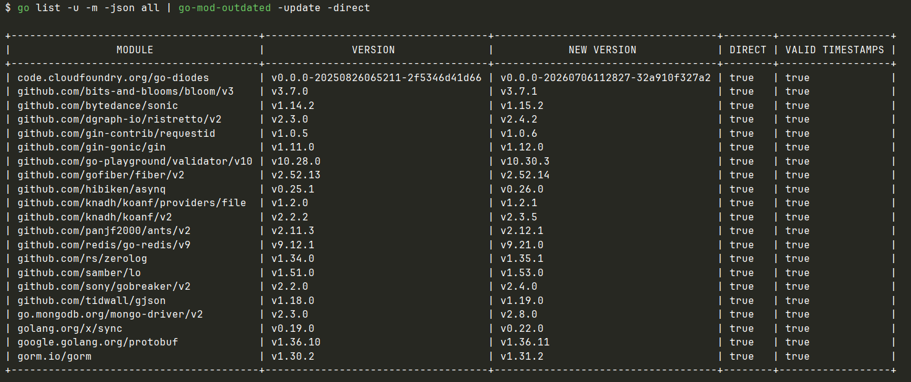

# 依赖升级风险评估

> 范围：`go list -u -m -json all | go-mod-outdated -update -direct` 报告的直接依赖更新。

## 依赖升级表格



## 结论

报告中的更新没有跨模块主版本迁移。多数 `v1+` 的次版本和补丁版本依照
语义化版本承诺保持 API 兼容；但其中数个依赖位于框架基础设施边界，仍必须
进行集成测试。应将 `github.com/hibiken/asynq v0.25.1 -> v0.26.0` 和未打
语义化标签的 `code.cloudfoundry.org/go-diodes` 伪版本更新视为潜在破坏性变更。

`go list -u -m` 只会更新当前模块路径，不能发现新的主版本导入路径，例如
`github.com/gofiber/fiber/v3`。

## 风险分级

| 风险 | 模块 | 仓库影响与必要验证 |
|---|---|---|
| 低 | `bloom/v3`、`gin-contrib/requestid`、`gofiber/fiber/v2`、`koanf/providers/file`、`zerolog`、`tidwall/gjson`、`protobuf` | 可作为补丁批次升级。验证布隆过滤器、请求 ID、日志、JSON 合法性检查、Protobuf 响应和 Fiber 健康检查路由。 |
| 中 | `validator/v10`、`koanf/v2`、`ants/v2`、`ristretto/v2`、`samber/lo`、`gobreaker/v2`、`x/sync` | 验证自定义校验标签与翻译、YAML/环境变量配置加载、缓存 TTL 与淘汰指标、异步缓存写入与关闭、熔断及 singleflight 行为。 |
| 高 | `bytedance/sonic`、`gin`、`redis/go-redis/v9`、`mongo-driver/v2`、`gorm` | 每个模块独立升级。这些模块提供 Web 框架、JSON、缓存、Redis 任务、MongoDB 和 MySQL 基础设施；须针对 Redis、MongoDB 和 MySQL 运行集成测试。 |
| 最高 | `hibiken/asynq`、`code.cloudfoundry.org/go-diodes` | Asynq 尚未到 v1，次版本可破坏兼容；其 Redis 持久化任务须验证新旧 worker 与 producer 的互操作性。Go-diodes 没有语义化发布标签且实现异步日志队列；须测试队列满载、丢日志指标、并发写入与关闭排空。 |

## 仓库特定边界

- Sonic 是默认高速 JSON 编解码器，同时供 Fiber 的 JSON 编码/解码器使用，
  并通过全局 `gin/codec/json` API 注入 Gin。相关文件：
  `component/jsoncodec/sonicjson.go`、`core_fiber_starter_impl.go` 与
  `core_gin_starter_impl.go`。
- Redis 同时服务于缓存实现和 Asynq 客户端/服务端构造。相关文件：
  `cache/cacheremote/redis_cache.go` 与 `task.go`。
- 本地/二级缓存耦合 Ristretto、Ants、Gobreaker、布隆过滤器及 singleflight。
  相关文件：`cache/cachelocal/local_cache.go`、`cache/cache2/level2_cache.go`
  与 `cache/cacheremote/redis_cache.go`。
- MongoDB 为 `decimal.Decimal` 配置了自定义 BSON 注册表；GORM 配置了预编译
  语句、连接池参数和自定义日志器。相关文件：`database/dbmongo/mongo.go` 与
  `database/dbmysql/mysql.go`。
- Koanf 同时加载 YAML 及由环境变量派生的配置。相关文件：
  `bootstrap/bootstrap.go`。

## 建议升级顺序

1. 以当前锁文件建立基线：运行 `go test ./...`、`go vet ./...` 和
   `go build ./example_main`。
2. 升级低风险补丁组，运行 `go mod tidy`，审阅 `go.mod` 和 `go.sum` 差异，
   再重复基线检查。
3. 单独升级配置/缓存组，并验证缓存保护、异步写入、配置覆盖和应用关闭。
4. Sonic、Gin、Redis、MongoDB 与 GORM 各自独立变更；不要将 Redis 与 Asynq
   升级放在同一个变更中。
5. 在 staging 独立升级 Asynq 和 Go-diodes；验证入队、延迟任务、重试、幂等、
   优雅关闭及与既有 Redis 任务数据的兼容性。

避免使用 `go get -u ./...`，该命令可能更新无关的间接依赖，使回归难以归因。
应显式锁定本批目标版本，例如：

```sh
go get github.com/bits-and-blooms/bloom/v3@v3.7.1 \
  github.com/gin-contrib/requestid@v1.0.6 \
  github.com/gofiber/fiber/v2@v2.52.14 \
  github.com/rs/zerolog@v1.35.1 \
  github.com/tidwall/gjson@v1.19.0 \
  google.golang.org/protobuf@v1.36.11
go mod tidy
```

## 主版本升级流程

Go 模块的主版本包含在导入路径中，因此迁移需要修改源代码，而非只修改
`go.mod`：

```sh
go list -m -versions github.com/gofiber/fiber/v3
go get github.com/gofiber/fiber/v3@latest
go mod tidy
```

迁移 Fiber v3 时，还必须选择明确支持 Fiber v3 的 Fiber contrib 包、Swagger
集成及其他插件版本，不能只升级 Fiber 本身。

GORM 是版本号阅读上的例外：GORM v2 使用 `gorm.io/gorm` 模块路径及
`v1.x` 模块版本，因此 `v1.30.2 -> v1.31.2` 不是 GORM 主版本迁移。

## Go 工具链与 CI

项目目前在 `go.mod` 中声明 `go 1.25`，CI 的
`.github/workflows/go1.yml` 使用 Go 1.25.x。接受每个目标模块前，应检查
其最低 Go 版本要求：

```sh
go list -m -json <module>@<version>
```

当前 CI 会构建示例应用并检查一个健康检查端点，但 `go test` 步骤被注释。
它不足以单独覆盖上述高风险基础设施升级。
