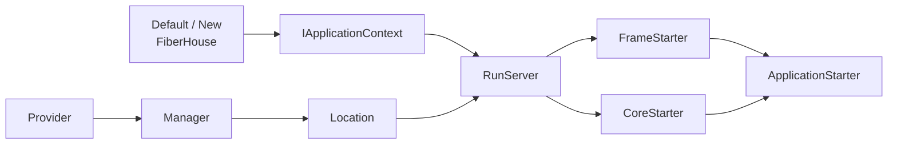

# 架构总览

FiberHouse 是一个用 Go 组装 Web 应用的框架。它把配置与日志引导、HTTP 内核选择、应用注册器和扩展装配串成一条启动链；数据库、缓存、异步任务和具体业务模块则由应用选择并承担生命周期。本文只描述当前源码可达的结构，不把目录、导出符号或示例等同于稳定能力。能力成熟度统一使用[《功能状态》](../reference/feature-status.md)中的“已接入”“实验性”“内部工具”“预留/占位”。

## FiberHouse 的职责边界

`FiberHouse` 的核心职责是：

- `New` / `Default` 建立 `BootConfig`、进程级配置、日志、`AppContext` 和 `GlobalManager` 引用；
- `WithProviders`、`WithPManagers`、`WithFrameStarterOptions`、`WithCoreStarterOptions` 收集启动装配；
- `RunServer` 按 `Type` 分发 Provider，按 Location 取出 Manager，创建 `FrameStarter` 与 `CoreStarter`，再驱动 Web 生命周期；
- `WebApplication` 把两个 Starter 组合成 `ApplicationStarter`，让上下文能够回到完整启动器。

框架核心不创建业务数据库、缓存、Repository、Service 或 API，也不把 `example_main`、`example_config`、`example_application` 变成生产模板。异步任务虽然由 `FrameStarter` 提供启动入口，但仍要求应用注册 `TaskRegister`、容器实例与外部 Redis，因此在功能分级中属于实验性应用能力，而不是框架核心盒子的一部分。

## Web 与 CLI 两种运行形态

| 形态 | 上下文 | 组合启动器 | 运行入口 | 当前边界 |
|---|---|---|---|---|
| Web | `IApplicationContext` / `AppContext` | `FrameStarter` + `CoreStarter` → `ApplicationStarter` | `(*FiberHouse).RunServer` | Fiber 已接入；Gin 有可达实现但整体仍为实验性 |
| CLI | `ICommandContext` / `CmdContext` | `FrameCmdStarter` + `CoreCmdStarter` → `CommandStarter` | `commandstarter.RunCommandStarter` | 独立于 `RunServer`，错误返回与资源回收尚未统一，属实验性 |

两种形态共享 `IContext` 的配置、日志、全局容器、验证器访问和 `IStarter` 回指，但它们不是同一条生命周期。Web 由 Provider/Manager/Location 选择 Frame 与 HTTP Core；CLI 当前直接组装 urfave/cli Starter，`RunCommandStarter` 依次初始化 core、错误处理、commands、全局选项和全局对象，然后运行命令。

## 核心组成

| 组成 | 当前职责 | 默认或装配条件 |
|---|---|---|
| `BootConfig` / `FiberHouse` | 选择 `FrameType`、`CoreType`、`TrafficCodec` 和配置、日志路径；保存 Options、Providers、Managers | `Default()` 只提供默认 `BootConfig`，不会自动调用默认 Provider/Manager 集合 |
| `IApplicationContext` | 暴露配置、日志、`GlobalManager`、验证器、Boot 配置、应用状态和 Starter 回指 | `New()` 创建进程级 `AppContext`，并把它注册到全局容器 |
| `FrameStarter` | 持有 `ApplicationRegister`、`ModuleRegister`、`TaskRegister`；初始化全局对象、验证器、任务和 keepalive | 默认实现是 `FrameApplication`；创建时至少需要有效的 `FrameStarterOption` 注入注册器 |
| `CoreStarter` | 初始化 Fiber/Gin，安装内置与应用中间件、模块路由、Swagger 和 hook，负责监听与关闭 | 由 `BootConfig.CoreType`、core Provider/Manager 和 core Options 选择 |
| `ApplicationStarter` | `FrameStarter` 与 `CoreStarter` 的组合接口 | `RunServer` 创建 `WebApplication` 并注册回 `AppContext` |
| Provider / Manager / Location | Provider 封装扩展，Manager 按类型收集并选择/执行 Provider，Location 标识生命周期位置 | 集合必须通过 `WithProviders` / `WithPManagers` 显式交给 `FiberHouse` |

关系保持为两条输入：Boot 建立上下文和 Starter，扩展系统把 Manager 放到生命周期位置。数据库、缓存、任务和示例均在图外。



## 依赖方向

稳定的依赖方向是“应用实现框架接口，框架在启动时回调应用”：

1. 业务应用实现 `ApplicationRegister`、`ModuleRegister`，按需实现 `TaskRegister`。
2. `FrameStarterOption` 把这些注册器注入 `FrameApplication`。
3. Provider 只依赖最小的 `IContext`；Manager 持有 `IContext` 并拥有同一 `Type` 的 Provider。
4. `RunServer` 依据 Manager 的 `Location` 选择阶段，再通过接口动态分派到 `FrameApplication` 和 `CoreWithFiber` / `CoreWithGin`。
5. Core Starter 回调应用注册器来安装应用中间件和 hook，回调模块注册器来注册路由与 Swagger。
6. 请求进入之后，API、Service、Repository 可经 `IContext` / Locator 访问已经装配好的只读基础设施。

`Type` 负责把 Provider 分给 Manager，`Target` 通常负责在同组中选择 Fiber/Gin 或其他实现，`Location` 负责决定 Manager 何时有机会被读取。三者都匹配才形成可达链；只有一个名称或一个目录不代表扩展已执行。

## 框架、默认装配与业务应用

`Default()` 与 `DefaultProviders()` / `DefaultPManagers(ctx)` 名称相近，但语义不同：

- `Default()` 只构造默认 Boot 配置并调用 `New()`；默认是 Fiber、Sonic、`./config`、`./logs`。
- `DefaultProviders()` 返回框架维护的 Provider 单例集合，包括 Frame、Fiber/Gin Core、JSON codec、recovery 和二进制响应 Provider。
- `DefaultPManagers(ctx)` 返回 Manager 单例集合，包括默认 fallback、Frame、Core、JSON codec、recovery 和响应 Manager。
- 应用仍需取 `List()` / `AndMore(...)`，再显式调用 `WithProviders(...)` 与 `WithPManagers(...)`。集合中的对象不等于自动启用。

默认集合也不提供业务注册器。没有应用提供的 Frame Options，默认 Frame Provider 无法创建一个可运行的 `FrameApplication`。同样，数据库、缓存、任务 worker、业务中间件和路由都要由应用注册；它们的初始化错误、资源所有权与关闭顺序也由应用承担。

默认集合本身是进程级单例。`Add`、`Except` 有锁，`List` 返回副本，但集合和其中对象仍应在启动装配阶段确定，不应在请求并发期间重配。

## 一次 Web 请求的位置

启动完成后，请求不再经过 `RunServer` 或 Location 调度。当前路径大致是：

```text
监听器 → Fiber/Gin Core → 内置 recovery / 错误处理 / 请求日志
       → ApplicationRegister 注册的应用中间件
       → ModuleRegister 注册的模块路由
       → API → Service → Repository / 外部资源
       → 统一响应与错误处理
```

这里的 API、Service、Repository 是应用分层辅助，不是 HTTP Core 的组成部分。Locator 在运行期按字符串 key 从 `GlobalManager` 查对象；Wire 生成的 injector 则在编译期展开构造关系。两者可以并存，但都不能替代正确的启动注册和资源关闭。

中间件与路由顺序由所选 Core、应用注册器和 Provider Manager 的实现共同决定。Manager 内部使用 map 保存 Provider，遍历顺序没有稳定保证；若顺序影响安全或正确性，应用必须在自己的注册函数中显式排序，而不能依赖 map 遍历。

## 阅读源码的入口

- [`boot.go`](../../boot.go)：`New`、`Default`、`RunServer`、`WebApplication` 与顶层动态分派。
- [`application_interface.go`](../../application_interface.go)：`FrameStarter`、`CoreStarter`、`ApplicationStarter` 及应用/模块/任务注册器。
- [`frame_starter_impl.go`](../../frame_starter_impl.go)：全局对象、验证器、任务与 keepalive 的默认 Frame 实现。
- [`core_fiber_starter_impl.go`](../../core_fiber_starter_impl.go) 与 [`core_gin_starter_impl.go`](../../core_gin_starter_impl.go)：HTTP Core 的初始化、回调、监听和关闭。
- [`provider_interface.go`](../../provider_interface.go)、[`provider_type.go`](../../provider_type.go)、[`provider_location.go`](../../provider_location.go)：Provider 扩展契约。
- [`context_interface.go`](../../context_interface.go)、[`context_impl.go`](../../context_impl.go)、[`locator_interface.go`](../../locator_interface.go)：上下文与 Locator。
- [`default.go`](../../default.go)：默认 Provider/Manager 集合；它是集合工厂，不是自动装配器。
- [`commandstarter/frame_cmd_application.go`](../../commandstarter/frame_cmd_application.go) 与 [`commandstarter/core_cmd_application.go`](../../commandstarter/core_cmd_application.go)：独立 CLI 运行形态。

继续阅读时应先看[《启动生命周期》](startup-lifecycle.md)确认阶段是否真实消费某个 Location，再看[《Provider 系统》](provider-system.md)和[《Context 与 Locator》](context-and-locators.md)判断对象如何进入并离开运行链。
